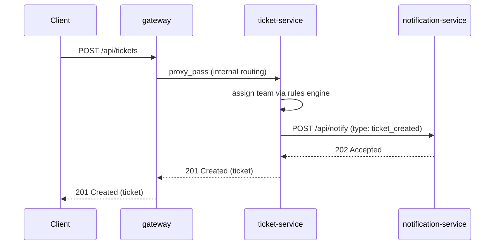

# RouteDesk

Internal request-routing app with a small web UI. Someone submits a ticket
(title, description, category) through the frontend, a rules engine assigns
it to the right team, a (dummy) email notification is fired, and the ticket
is stored for lookup, status updates, assignment, and archiving. Built as
three separate microservices to demonstrate Heroku's real
[Internal Routing](https://devcenter.heroku.com/articles/internal-routing)
feature inside a Private Space.

## How it works

1. **Create a ticket** — open the gateway's public URL, fill in the form
   (title, description, category), submit. The gateway proxies the POST to
   ticket-service, which runs it through the rules engine (see below) to
   assign a team, stores it in memory, and fires a "new ticket" email to the
   team's dummy address (e.g. `sre-oncall@routedesk.example.com`) via
   notification-service.
2. **View / triage** — the ticket list on the page shows every open ticket
   with its team, status, and assignee. Clicking a row opens a detail panel
   with the full description.
3. **Assign + update status** — from the detail panel, pick an assignee from
   that team's roster and/or change status (`open` → `in-progress` →
   `resolved` → `closed`). Saving `PATCH`es the ticket; if the assignee
   changed, ticket-service fires a second "you've been assigned" email to
   that person's dummy address.
4. **Archive** — the detail panel's Archive button soft-deletes the ticket
   (marks it `archived: true` instead of removing it). Archived tickets are
   hidden from the default list; check "Show archived" to see them again.

None of this touches a real mailbox — see [Notifications](#notifications)
below for how the dummy emails work.

## Architecture

Three separate Heroku apps, all in the same Heroku Private Space:

- **gateway** (`routedesk-gateway`) — the only public app. nginx
  ([heroku-buildpack-nginx](https://github.com/heroku/heroku-buildpack-nginx))
  binds Heroku's `$PORT`, serves the static frontend (`gateway/public/`) at
  `/`, and reverse-proxies `/health` and `/api/tickets` to the
  ticket-service app.
- **ticket-service** (`routedesk-ticket-service`) — Express app with the
  routing rules engine, ticket storage, and the sample team roster. Created
  with `--internal-routing`, so it's **not** publicly reachable — only apps
  in the same Private Space (i.e. the gateway) can call it. Calls
  notification-service on ticket creation and on assignment.
- **notification-service** (`routedesk-notification-service`) — Express
  stub with a dummy email sender: it logs what it *would* send instead of
  calling a real provider. Also created with `--internal-routing`; only
  ticket-service calls it.

Internal Routing works at the **app** level, addressed by each app's own
hostname, with valid TLS out of the box — there's no port-based or
per-process addressing. `--internal-routing` just restricts who's allowed
to reach that hostname to other apps/networks in the same Space. Each
service still binds Heroku's dynamic `$PORT` like any normal web dyno.

Note: Private Space apps get a **randomized** default hostname, not
`<appname>.herokuapp.com` — e.g. `routedesk-gateway` might actually be
reachable at `routedesk-gateway-bb1f76514aa7.herokuapp.com`. Always get the
real hostname with `heroku apps:info -a <app-name>` rather than assuming it
from the app name. (If your desired app name is already taken on Heroku,
you'll need to pick a unique variant — a short prefix or suffix works.)

| App | Reachable from |
|---|---|
| `routedesk-gateway` | public internet |
| `routedesk-ticket-service` | only apps in the same Private Space |
| `routedesk-notification-service` | only apps in the same Private Space |


### Request flow

Creating a ticket touches all three apps in one request:



Assigning a ticket later follows the same pattern on a `PATCH`:
`C->>G->>T` (`PATCH /api/tickets/:id`) `->>N` (`POST /api/notify`, type
`ticket_assigned`) — see [Notifications](#notifications).

### Routing rules (MVP)

| category    | team            |
|-------------|-----------------|
| billing     | finance-ops     |
| outage      | sre-oncall      |
| incident    | sre-oncall      |
| bug         | engineering     |
| access      | it-support      |
| permissions | it-support      |
| (anything else) | general-support |

Tickets are stored in memory — restarting the dyno clears them. Swap in
Postgres later if persistence is needed.

### API (ticket-service, proxied through the gateway)

| Method | Path | What it does |
|---|---|---|
| `POST` | `/api/tickets` | Create a ticket. Routes to a team, fires a `ticket_created` email. |
| `GET` | `/api/tickets` | List non-archived tickets. Add `?includeArchived=true` to include archived ones. |
| `GET` | `/api/tickets/:id` | Fetch one ticket. |
| `PATCH` | `/api/tickets/:id` | Update `status` and/or `assignee`. A new/changed `assignee` fires a `ticket_assigned` email. |
| `DELETE` | `/api/tickets/:id` | Archive (soft-delete) a ticket — sets `archived: true`, doesn't remove it. |
| `GET` | `/api/tickets/meta/roster` | Valid statuses + per-team sample roster (name + dummy email), used by the frontend's dropdowns. |

## Notifications

notification-service doesn't send real email — it has a `sendEmail()` stub
(`notification-service/index.js`) that just `console.log`s what it would
send. There's no SMTP/SES/SendGrid setup, so nothing leaves the dyno; check
`heroku logs -a routedesk-notification-service` to see it fire. Two events
trigger it, both called from `ticket-service/routes/tickets.js`:

- **Ticket created** (`notifyTeam`) — emails a made-up team address,
  `<team>@routedesk.example.com` (e.g. `sre-oncall@routedesk.example.com`).
- **Ticket assigned** (`notifyAssignee`) — emails the assignee's dummy
  address from the sample roster (e.g. `diego.ramirez@routedesk.example.com`),
  looked up via `findAssigneeEmail(team, name)`. Only fires when the
  assignee actually changes to a non-empty value.

Both go through the same `POST /api/notify` endpoint with a `type` field
(`ticket_created` or `ticket_assigned`) so notification-service can pick the
right recipient/subject. To wire up real email, replace the body of
`sendEmail()` in `notification-service/index.js` with a call to an actual
provider — nothing else needs to change.

## Local development (Docker Compose)

```bash
docker compose up --build
open http://localhost:8080          # the ticket UI
curl http://localhost:8080/health
curl -X POST http://localhost:8080/api/tickets \
  -H 'Content-Type: application/json' \
  -d '{"title":"VPN broken","category":"access"}'
curl http://localhost:8080/api/tickets
```

Compose runs all three services as separate containers on one network
(`gateway`, `ticket-service`, `notification-service`), using plain HTTP and
Docker's built-in service-name DNS — there's no Private Space locally, so
this is the closest low-friction equivalent. The gateway container mounts
`gateway/public/` as its static root, so the same frontend used in
production works locally too. Watch the `notification-service` container
logs (`docker compose logs -f notification-service`) to see the dummy
`[email] ...` lines fire after creating a ticket or assigning one.

## Deploying to Heroku (Private Space + Internal Routing)

Requires Heroku Enterprise (Private Spaces). Each service is its own app,
deployed from its own subfolder of this one repo. The three apps already
exist (created once, see below) — buildpacks and config vars are already
set. To (re)deploy code after changing a service, push its subtree to its
Heroku remote:

```bash
git subtree push --prefix=gateway              heroku-gateway     main
git subtree push --prefix=ticket-service        heroku-ticket      main
git subtree push --prefix=notification-service  heroku-notification main
```

Those `heroku-*` remotes were added once with:

```bash
heroku git:remote -a routedesk-gateway          -r heroku-gateway
heroku git:remote -a routedesk-ticket-service    -r heroku-ticket
heroku git:remote -a routedesk-notification-service -r heroku-notification
```

One-time setup that was already done to create and wire up the three apps
(kept here for reference / recreating in another space — swap in your own
space/team names and app names, since app names must be globally unique
across all of Heroku):

```bash
# 1. Create all three apps in the same Private Space.
#    Internal-routing can only be set at creation time. App names must be
#    <= 30 characters.
heroku apps:create routedesk-gateway --space <your-space> --team <your-team>
heroku apps:create routedesk-ticket-service --space <your-space> --team <your-team> --internal-routing
heroku apps:create routedesk-notification-service --space <your-space> --team <your-team> --internal-routing

# 2. Buildpacks per app
heroku buildpacks:add heroku/nodejs -a routedesk-ticket-service
heroku buildpacks:add heroku/nodejs -a routedesk-notification-service
heroku buildpacks:add https://github.com/heroku/heroku-buildpack-nginx -a routedesk-gateway

# 3. Get each internal-routing app's real hostname (randomized, not
#    derived from the app name), then wire the apps together with it
heroku apps:info -a routedesk-ticket-service | grep herokuapp.com
heroku apps:info -a routedesk-notification-service | grep herokuapp.com

heroku config:set NOTIFICATION_SERVICE_URL=https://<notification-service-real-hostname> \
  -a routedesk-ticket-service
heroku config:set TICKET_SERVICE_HOST=<ticket-service-real-hostname> \
  -a routedesk-gateway
```

Notes:

- Automated Certificate Management (ACM) is **not** compatible with
  Internal Routing — not an issue here since these two apps have no custom
  domains, only the default randomized `*.herokuapp.com` hostname (which
  has valid TLS by default).
- At least one web dyno must be running on an internal-routing app for its
  hostname to resolve correctly from other apps in the Space.
- `--internal-routing` cannot be added to an app after creation — it must
  be set with `heroku apps:create`.
- Heroku app names are capped at 30 characters and must be globally unique
  across all of Heroku — if your desired name is taken, adjust it (e.g. a
  short prefix/suffix) and update the commands and config vars above to
  match.

## Adding another microservice

1. Create a new subfolder (its own `package.json`, `index.js`, `Procfile`,
   `app.json`, `Dockerfile`).
2. Create its Heroku app with `--internal-routing` (unless it needs to be
   public) in the same Private Space.
3. Add a config var on the caller with its hostname, and a `location` block
   in `gateway/config/nginx.conf.erb` if the gateway needs to route to it
   directly.
4. Add it to `docker-compose.yml` for local development.
