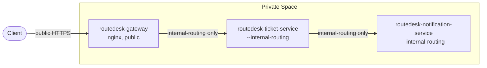
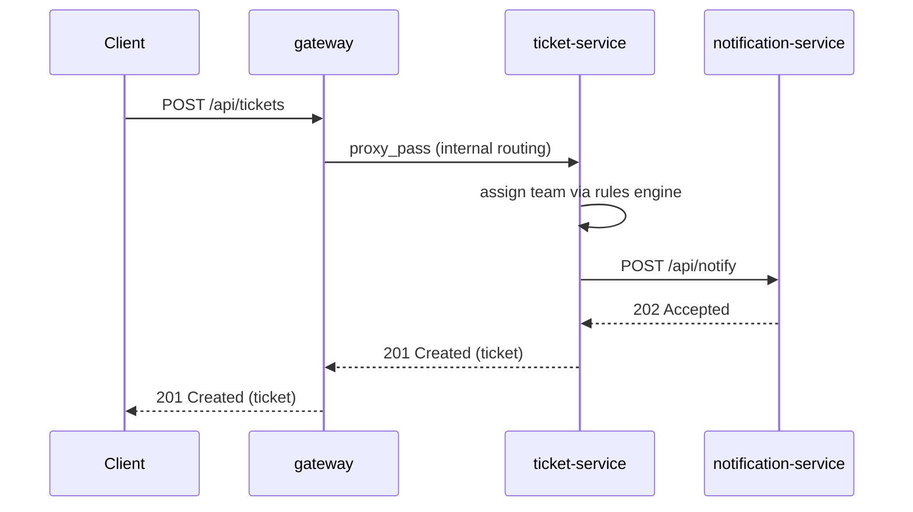

# RouteDesk

Internal request-routing app. Someone submits a request (title, description,
category), a rules engine assigns it to the right team, a notification is
fired, and the ticket is stored for lookup. Built as three separate
microservices to demonstrate Heroku's real
[Internal Routing](https://devcenter.heroku.com/articles/internal-routing)
feature inside a Private Space.

## Architecture

Three separate Heroku apps, all in the same Heroku Private Space:

- **gateway** (`routedesk-gateway`) — the only public app. nginx
  ([heroku-buildpack-nginx](https://github.com/heroku/heroku-buildpack-nginx))
  binds Heroku's `$PORT` and reverse-proxies `/health` and `/api/tickets` to
  the ticket-service app.
- **ticket-service** (`routedesk-ticket-service`) — Express app with the
  routing rules engine. Created with `--internal-routing`, so it's **not**
  publicly reachable — only apps in the same Private Space (i.e. the
  gateway) can call it. On ticket creation it calls notification-service.
- **notification-service** (`routedesk-notification-service`) — Express
  stub that logs "would notify team X about ticket Y". Also created with
  `--internal-routing`; only ticket-service calls it.

Internal Routing works at the **app** level, addressed by each app's own
hostname, with valid TLS out of the box — there's no port-based or
per-process addressing. `--internal-routing` just restricts who's allowed
to reach that hostname to other apps/networks in the same Space. Each
service still binds Heroku's dynamic `$PORT` like any normal web dyno.

Note: Private Space apps get a **randomized** default hostname, not
`<appname>.herokuapp.com` — e.g. `routedesk-gateway` might actually be
reachable at `routedesk-gateway-bb1f76514aa7.herokuapp.com`. Always get the
real hostname with `heroku apps:info -a <app-name>` rather than assuming it
from the app name. (If your desired app name is already taken on Heroku,
you'll need to pick a unique variant — a short prefix or suffix works.)

| App | Reachable from |
|---|---|
| `routedesk-gateway` | public internet |
| `routedesk-ticket-service` | only apps in the same Private Space |
| `routedesk-notification-service` | only apps in the same Private Space |



### Request flow

Creating a ticket touches all three apps in one request:



### Routing rules (MVP)

| category    | team            |
|-------------|-----------------|
| billing     | finance-ops     |
| outage      | sre-oncall      |
| incident    | sre-oncall      |
| bug         | engineering     |
| access      | it-support      |
| permissions | it-support      |
| (anything else) | general-support |

Tickets are stored in memory — restarting the dyno clears them. Swap in
Postgres later if persistence is needed.

## Local development (Docker Compose)

```bash
docker compose up --build
curl http://localhost:8080/health
curl -X POST http://localhost:8080/api/tickets \
  -H 'Content-Type: application/json' \
  -d '{"title":"VPN broken","category":"access"}'
curl http://localhost:8080/api/tickets
```

Compose runs all three services as separate containers on one network
(`gateway`, `ticket-service`, `notification-service`), using plain HTTP and
Docker's built-in service-name DNS — there's no Private Space locally, so
this is the closest low-friction equivalent. Watch the `notification-service`
container logs to see the "would notify team X" line fire after creating a
ticket.

## Deploying to Heroku (Private Space + Internal Routing)

Requires Heroku Enterprise (Private Spaces). Each service is its own app,
deployed from its own subfolder of this one repo. The three apps already
exist (created once, see below) — buildpacks and config vars are already
set. To (re)deploy code after changing a service, push its subtree to its
Heroku remote:

```bash
git subtree push --prefix=gateway              heroku-gateway     main
git subtree push --prefix=ticket-service        heroku-ticket      main
git subtree push --prefix=notification-service  heroku-notification main
```

Those `heroku-*` remotes were added once with:

```bash
heroku git:remote -a routedesk-gateway          -r heroku-gateway
heroku git:remote -a routedesk-ticket-service    -r heroku-ticket
heroku git:remote -a routedesk-notification-service -r heroku-notification
```

One-time setup that was already done to create and wire up the three apps
(kept here for reference / recreating in another space — swap in your own
space/team names and app names, since app names must be globally unique
across all of Heroku):

```bash
# 1. Create all three apps in the same Private Space.
#    Internal-routing can only be set at creation time. App names must be
#    <= 30 characters.
heroku apps:create routedesk-gateway --space <your-space> --team <your-team>
heroku apps:create routedesk-ticket-service --space <your-space> --team <your-team> --internal-routing
heroku apps:create routedesk-notification-service --space <your-space> --team <your-team> --internal-routing

# 2. Buildpacks per app
heroku buildpacks:add heroku/nodejs -a routedesk-ticket-service
heroku buildpacks:add heroku/nodejs -a routedesk-notification-service
heroku buildpacks:add https://github.com/heroku/heroku-buildpack-nginx -a routedesk-gateway

# 3. Get each internal-routing app's real hostname (randomized, not
#    derived from the app name), then wire the apps together with it
heroku apps:info -a routedesk-ticket-service | grep herokuapp.com
heroku apps:info -a routedesk-notification-service | grep herokuapp.com

heroku config:set NOTIFICATION_SERVICE_URL=https://<notification-service-real-hostname> \
  -a routedesk-ticket-service
heroku config:set TICKET_SERVICE_HOST=<ticket-service-real-hostname> \
  -a routedesk-gateway
```

Notes:

- Automated Certificate Management (ACM) is **not** compatible with
  Internal Routing — not an issue here since these two apps have no custom
  domains, only the default randomized `*.herokuapp.com` hostname (which
  has valid TLS by default).
- At least one web dyno must be running on an internal-routing app for its
  hostname to resolve correctly from other apps in the Space.
- `--internal-routing` cannot be added to an app after creation — it must
  be set with `heroku apps:create`.
- Heroku app names are capped at 30 characters and must be globally unique
  across all of Heroku — if your desired name is taken, adjust it (e.g. a
  short prefix/suffix) and update the commands and config vars above to
  match.

## Adding another microservice

1. Create a new subfolder (its own `package.json`, `index.js`, `Procfile`,
   `app.json`, `Dockerfile`).
2. Create its Heroku app with `--internal-routing` (unless it needs to be
   public) in the same Private Space.
3. Add a config var on the caller with its hostname, and a `location` block
   in `gateway/config/nginx.conf.erb` if the gateway needs to route to it
   directly.
4. Add it to `docker-compose.yml` for local development.
